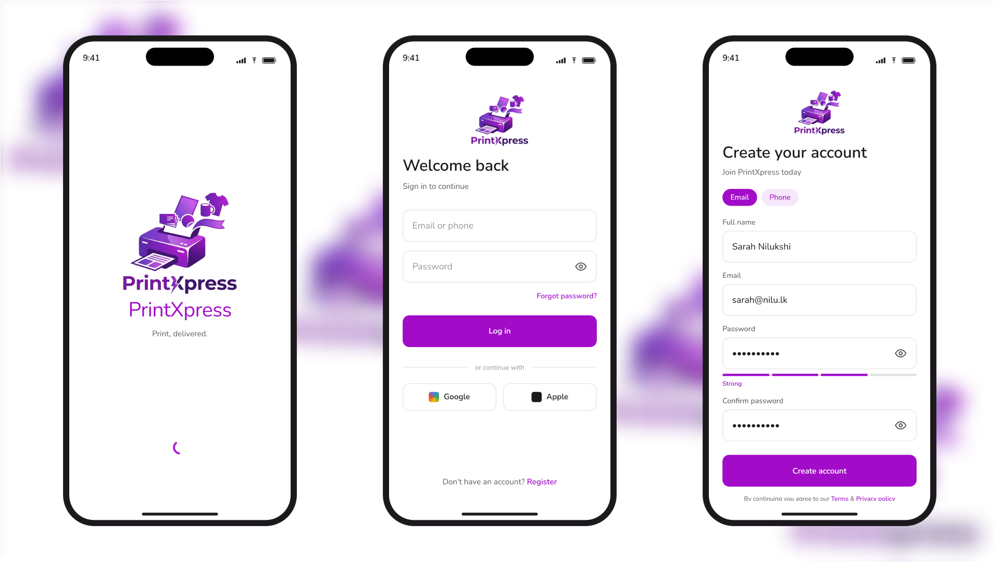
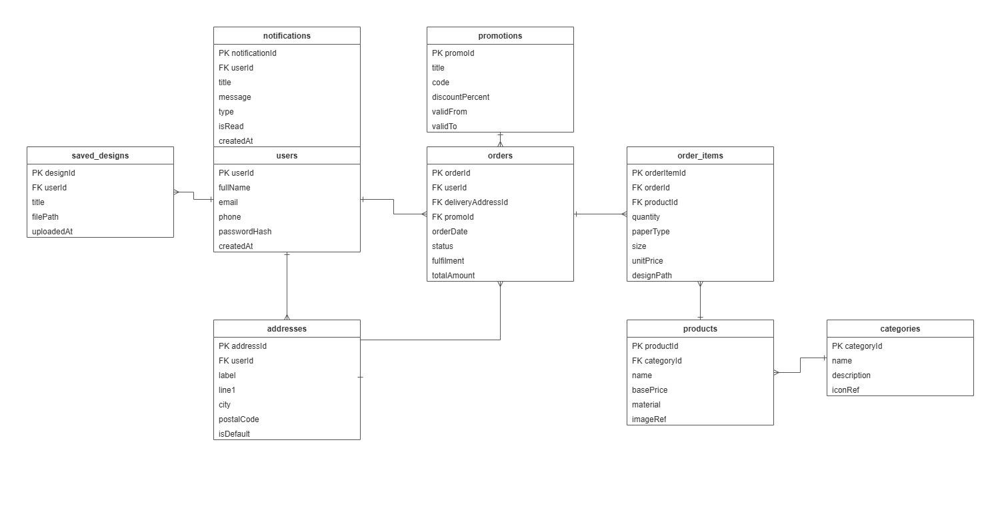
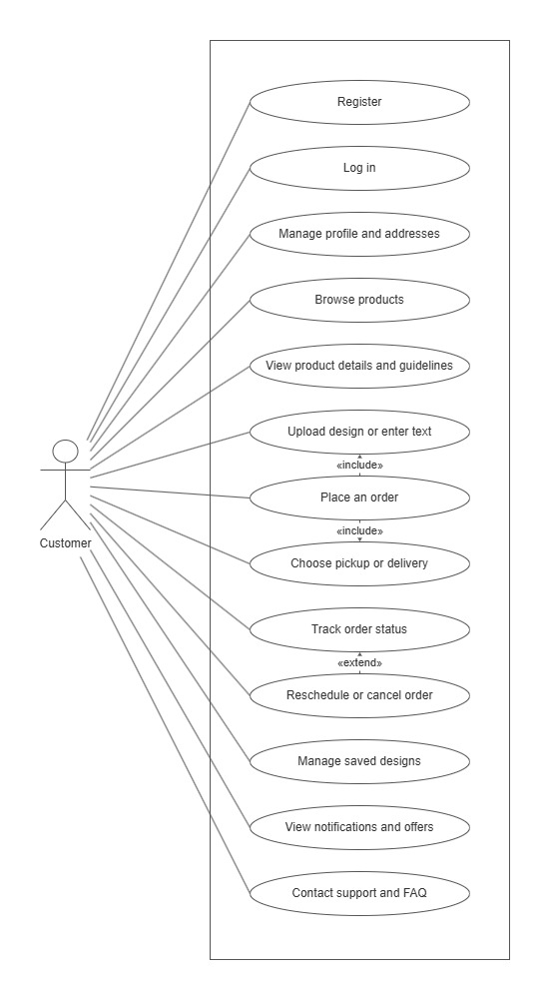
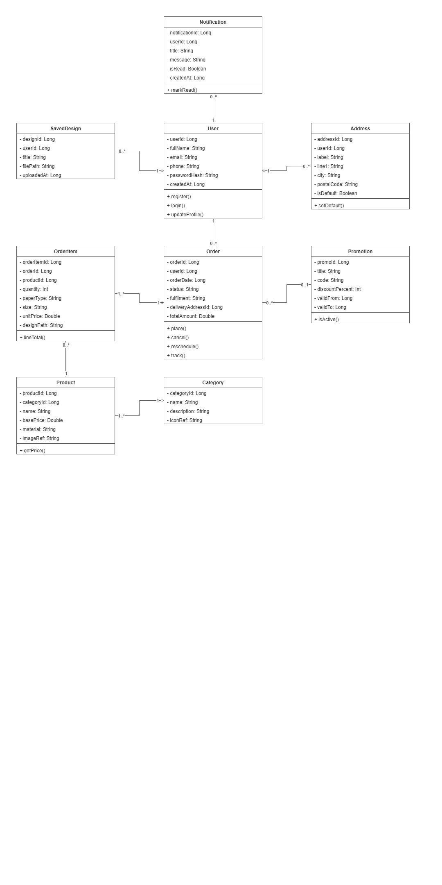
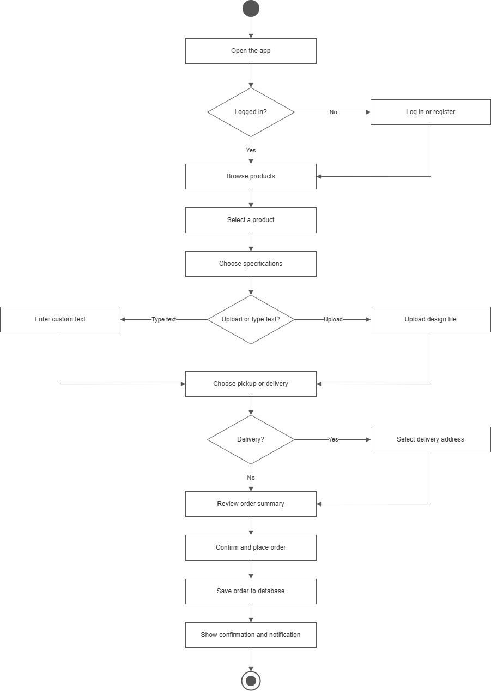
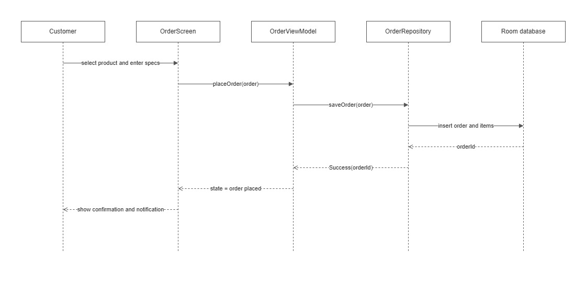

<div align="center">

  
  <h1>PrintXpress</h1>

  <p>
    A native Android app for a digital printing service in Sri Lanka.
  </p>

<!-- Badges -->
<p>
  
  
  
  
  
  
</p>

<h4>
  <a href="#star2-introduction">Introduction</a>
  <span> · </span>
  <a href="#zap-getting-started">Get started</a>
  <span> · </span>
  <a href="https://github.com/TharushiHiranya/PrintXpress/releases" target="_blank">Download</a>
</h4>

</div>

<br />

## :star2: Introduction

PrintXpress is a native Android app for a digital printing service in Sri Lanka. It lets individuals and small businesses order printed items from their phone instead of visiting a shop or sending files over chat apps. Customers browse products, choose specifications, upload a design or type custom text, and place an order for pickup or home delivery. The app stores all data locally with Room on top of SQLite, so it runs fully offline on any Android phone.

This is a university assignment for module CSE5011, built in Kotlin with Jetpack Compose. The design is one accent colour on a white background with dark gray text, consistent throughout every screen.

<!-- Screenshots -->

### :camera: Screenshots

<div align="center">
  
</div>

<!-- TechStack -->

### :space_invader: Tech stack

<details>
  <summary>App</summary>
  <ul>
    <li><a href="https://kotlinlang.org/" target="_blank">Kotlin</a></li>
    <li><a href="https://developer.android.com/jetpack/compose" target="_blank">Jetpack Compose</a></li>
    <li><a href="https://developer.android.com/training/data-storage/room" target="_blank">Room (SQLite)</a></li>
    <li><a href="https://developer.android.com/topic/libraries/architecture/viewmodel" target="_blank">ViewModel</a></li>
    <li><a href="https://m3.material.io/" target="_blank">Material 3</a></li>
  </ul>
</details>

<details>
  <summary>Build</summary>
  <ul>
    <li><a href="https://developer.android.com/studio" target="_blank">Android Studio</a></li>
    <li><a href="https://gradle.org/" target="_blank">Gradle with version catalog</a></li>
    <li><a href="https://developer.android.com/build/migrate-to-ksp" target="_blank">KSP (for Room annotation processing)</a></li>
  </ul>
</details>

<!-- Features -->

### :dart: Features

- **Browse the catalog.** The home screen shows product categories: business cards, posters, banners, flyers, stickers, mugs, and t-shirts. Each category lists its products with name, base price, material, sample image, and the size and material options.

- **Design upload or custom text.** When placing an order, the customer either picks an image or PDF from their phone, or types custom text. Either one is required before the item can be added.

- **Pickup or delivery.** The customer chooses pickup or home delivery. Delivery orders ask for a saved address. The default address is pre-selected to speed up checkout.

- **Order tracking and status.** The orders screen lists every order with its date, total, and status. Status moves through processing, printing, ready for pickup, out for delivery, completed, and cancelled.

- **Cancel or reschedule.** Cancel and reschedule are available only while the order is still processing. Once printing starts, both options are hidden.

- **In-app notifications.** Placing an order and completing one both create a notification. Notifications show in a list with an unread marker. Tapping one marks it read.

- **Seasonal offers.** Active offers appear on the home screen with their title, discount, code, and valid dates. Expired offers are hidden automatically.

- **Saved designs.** Uploaded designs can be saved with a title and reused on a later order without uploading again.

- **Print guidelines and FAQs.** A guidelines screen explains accepted file types, resolution, colour mode, and bleed. An FAQ screen lists common questions and the shop's contact details.

- **Fully offline.** All data is stored on the device. The app works with no internet connection.

<!-- Color Reference -->

### :art: Colour reference

| Role                   | Hex       |
| ---------------------- | --------- |
| Accent (primary)       | `#A20BC8` |
| Accent container       | `#F6E7FA` |
| On accent              | `#FFFFFF` |
| Background and surface | `#FFFFFF` |
| Text primary           | `#1A1A1A` |
| Text secondary         | `#5C5C5C` |
| Text disabled          | `#9A9A9A` |
| Divider                | `#E0E0E0` |

<!-- Getting Started -->

## :zap: Getting started

### :bangbang: Prerequisites

1. **Android Studio** (a recent stable version) with the Android SDK for API 36. Download from [developer.android.com/studio](https://developer.android.com/studio).
2. **Java 17 or later**, which Android Studio bundles automatically.
3. An Android device or emulator running **Android 7.0 (API 24) or later**.

### :running: Run locally

1. Clone the project.

```bash
git clone https://github.com/TharushiHiranya/PrintXpress.git
```

2. Open the project folder in Android Studio and wait for Gradle to sync.

3. Pick an emulator or a connected phone running Android 7.0 or later.

4. Press **Run** (Shift+F10) to build and install the app. The first launch creates the database and seeds the starting catalog, so products appear straight away.

### :package: Install from APK

1. Download the latest APK from the [Releases](https://github.com/TharushiHiranya/PrintXpress/releases) page.
2. Copy the APK file to your Android phone.
3. Open the file on the phone. If prompted, allow installing from this source.
4. Open the app once it is installed.

<!-- Database -->

## :floppy_disk: Database

PrintXpress uses **Room** on top of **SQLite** for all storage. The whole database lives on the device, so the app works offline and needs no server. The database is a single portable SQLite file that can be opened with [DB Browser for SQLite](https://sqlitebrowser.org/) (free) for inspection.

### Tables

| Table           | Purpose                                                                                           |
| --------------- | ------------------------------------------------------------------------------------------------- |
| `users`         | One row per account. Email or phone is the login id. Password is stored hashed, never plain text. |
| `addresses`     | Delivery addresses for a user. One can be marked as the default.                                  |
| `categories`    | Top-level product groups, seeded on first run.                                                    |
| `products`      | Printable products with base price, material, and available options.                              |
| `orders`        | One row per placed order, including status, fulfilment type, and the stored total.                |
| `order_items`   | The lines inside an order: product, specs, quantity, design file, or custom text.                 |
| `saved_designs` | Designs a user saved to reuse on later orders.                                                    |
| `notifications` | In-app messages for order events and offers.                                                      |
| `promotions`    | Seasonal offers with discount codes. Supports percentage off, fixed amount off, or free delivery. Can target a specific product or category. |

### Entity relationship diagram



The diagram uses crow's foot notation. Every table has a single auto-generated `Long` primary key. Foreign keys link children to parents with cascade delete where a child has no meaning without its parent. An order's delivery address and promotion are optional foreign keys, since pickup orders have no address and orders may have no promotion.

### Seeding

The starting catalog (categories, products, and sample promotions) is loaded the first time the database is created using a `RoomDatabase.Callback`. There is no pre-built file to keep in sync with the schema, which makes this the most reliable approach for a beginner.

### Export the database

To inspect the database after running the app:

1. In Android Studio, open **View > Tool Windows > Device Explorer**.
2. Go to `data/data/com.hiranya.printxpress/databases/`.
3. Right-click `printxpress.db` and choose **Save As** to copy it to your computer.
4. Open the file in [DB Browser for SQLite](https://sqlitebrowser.org/) to view the tables and rows.

<!-- System Design -->

## :triangular_ruler: System design

All diagrams use the brand accent for borders, text, and lines, with right-angle connectors. The draw.io source files are in `docs/diagrams/` (not published here, but the exports below show the full designs).

### Use case diagram



The use case diagram shows what a customer can do with PrintXpress. There is one human actor because this version is a customer-only app. Place an order includes two steps: upload design or enter text, and choose pickup or delivery. Reschedule or cancel order extends track order status, since it is optional and only available while processing.

### Class diagram



The class diagram shows the main domain classes and how they relate. User is the centre of the model. An order has composition with order items (a filled diamond), because an item has no meaning without its order. Product to order item is a plain association, because deleting an order line must never delete the product.

### Activity diagram



The activity diagram models the place order journey from opening the app to the confirmation. The first decision checks login state. The second lets the customer upload a file or type text. The third handles delivery, asking for an address only on the delivery branch.

### Sequence diagram



The sequence diagram shows the messages that pass between the five lifelines when a customer places an order: the customer, the order screen (Compose UI), the order view model, the order repository, and Room. The UI never touches the database directly. It calls the view model, which calls the repository, which calls Room.

<!-- Architecture -->

## :building_construction: Architecture

The app uses a simple layered design so each part has one job.

1. **UI (Compose screens)** shows state and sends user actions to a view model. It never touches the database directly.
2. **View models** hold the screen state and call repositories. They expose state to the UI with Compose state holders.
3. **Repositories** wrap the DAOs and give the rest of the app clean methods such as `placeOrder` or `login`.
4. **Data layer** holds the Room entities, the DAOs, and the database class.

```
app/src/main/java/com/hiranya/printxpress/
  data/
    entity/      Room @Entity classes
    dao/         @Dao interfaces, one per area
    repository/  repositories that wrap the DAOs
    util/        HashUtil.kt, SessionManager.kt
    PrintXpressDatabase.kt
  ui/
    theme/       Color.kt, Type.kt, Theme.kt
    screens/     one Composable file per screen
    components/  small reusable Composables
  viewmodel/     one ViewModel per screen area
  MainActivity.kt
```

<!-- User Guide -->

## :book: User guide

### Install the app

1. Download the APK from the [Releases](https://github.com/TharushiHiranya/PrintXpress/releases) page.
2. Copy it to your phone and open the file.
3. If prompted, allow installing from this source.

### Create an account

1. On the welcome screen, tap **Register**.
2. Enter your full name, your email or phone number, and a password of at least six characters.
3. Tap **Register**. You land on the home screen, already logged in.

Your password is stored in a scrambled form, so it is never kept as plain text.

### Browse and order

1. The home screen shows product categories. Tap a category to see its products.
2. Tap a product to see its price, material, sample image, and options.
3. Choose quantity, material, and size. The price updates as you choose.
4. Add your design by tapping **Upload** to pick an image or PDF, or type in the custom text box.
5. Choose pickup or delivery. For delivery, pick a saved address.
6. Tap **Place order**. The confirmation screen shows your order number and a summary.

### Track and manage orders

Open the **Orders** screen to see all your orders. Tap an order to see its items and full status. Cancel or reschedule is available only while the status is processing. Once printing starts, both options are off.

<!-- Technical Guide -->

## :wrench: Technical guide

### State management

State stays simple. A view model holds screen state in `mutableStateOf` or a `StateFlow`, and the UI reads it. User actions call view model functions, which call repositories, which call the DAOs. There is no shared global state and no manual threading beyond the `suspend` DAO calls.

### Security

Passwords are hashed before saving. Plain text passwords are never stored or logged. Input is validated before any save: required fields, email and phone formats, password length, and order item checks.

### Limitations

These are out of scope by design.

1. No online payment. Orders are paid on pickup or delivery.
2. No staff or admin app. Order status changes are simulated for the demo.
3. No real SMS or push delivery. Notifications are stored and shown inside the app.
4. No cloud sync. All data stays on the one device.

<!-- Acknowledgements -->

## :gem: Acknowledgements

- [Android Documentation](https://developer.android.com/) for the platform guides and API references.
- [Material Design 3](https://m3.material.io/) for the design system and component guidelines.
- [DB Browser for SQLite](https://sqlitebrowser.org/) for making it easy to inspect the local database.
- [Awesome README Template by Louis3797](https://github.com/Louis3797/awesome-readme-template) for the README structure and layout.
